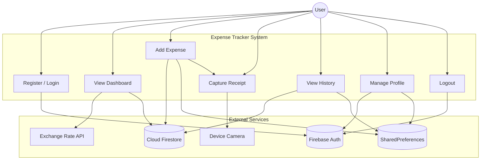
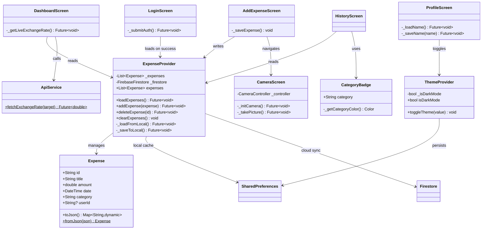

# Expense Tracker

A Flutter-based mobile application for tracking personal expenses with receipt photo capture, currency conversion, and cloud synchronization.

---

## Table of Contents

1. [Introduction](#introduction)
2. [Problem Statement](#problem-statement)
3. [Objectives](#objectives)
4. [Features](#features)
5. [Project Design](#project-design)
   - [Use Case Diagram](#use-case-diagram)
   - [Class Diagram](#class-diagram)
   - [Components Used](#components-used)
6. [Tech Stack](#tech-stack)
7. [Screenshots](#screenshots)
8. [Getting Started](#getting-started)
   - [Prerequisites](#prerequisites)
   - [Installation](#installation)
   - [Firebase Setup](#firebase-setup)
9. [Who Did What](#who-did-what)
   - [Team Members & Responsibilities](#team-members--responsibilities)
   - [File Ownership Matrix](#file-ownership-matrix)
   - [Integration Points](#integration-points)
   - [Component-Based Skills Covered](#component-based-skills-covered)
10. [Project Structure](#project-structure)
11. [Conclusion](#conclusion)
12. [References](#references)

---

## Introduction

Expense Tracker is a cross-platform mobile application built with Flutter that helps users monitor and manage their daily expenses. Users can log expenses by category, view spending analytics through interactive charts, capture receipt photos using the device camera, and sync their data securely to the cloud via Firebase Firestore.

The application was developed as part of the CBSD (Component-Based Software Development) 2026 curriculum, demonstrating proficiency in Flutter framework, Firebase backend integration, REST APIs, native device features, state management, and component-based architecture.

---

## Problem Statement

Managing personal finances is a common challenge for students and professionals alike. Many individuals struggle to track where their money goes each month, leading to overspending and poor financial planning. Existing solutions are either too complex, require subscriptions, or lack offline support. There is a need for a simple, intuitive, and free expense tracking application that:

- Allows quick logging of expenses on the go
- Provides visual spending breakdowns by category
- Supports receipt capture for record-keeping
- Synchronizes data securely across devices
- Works offline with local storage fallback

---

## Objectives

1. **Simplify Expense Tracking**: Provide an intuitive interface to log expenses with minimal friction
2. **Visual Analytics**: Display spending patterns through pie charts for better financial awareness
3. **Receipt Management**: Enable users to capture and associate receipt photos with expenses
4. **Secure Authentication**: Implement email/password authentication using Firebase Auth
5. **Cloud Synchronization**: Store expense data in Firestore for cross-device access and backup
6. **Offline Support**: Maintain local storage via SharedPreferences as a fallback when offline
7. **Custom Reusable Components**: Develop and integrate custom Flutter widgets following CBSD principles
8. **Native Feature Integration**: Leverage device camera for receipt photo capture
9. **API Integration**: Fetch live currency exchange rates for multi-currency support
10. **Theme Support**: Provide light and dark mode with persistent user preferences

---

## Features

- **Authentication**: Sign up / Sign in with email and password (Firebase Auth)
- **Dashboard**: View total spending, toggle USD/EGP currency, and analyze category breakdowns via pie chart
- **Add Expense**: Log expenses with title, amount, category, and optional receipt photo
- **Expense History**: Browse past transactions with category badges and formatted dates
- **Receipt Capture**: Take photos of receipts using the device camera with permission handling
- **Profile Management**: Update display name, toggle dark mode, and sign out
- **Cloud Sync**: Expenses stored in Firestore for multi-device access
- **Offline Mode**: Local SharedPreferences cache ensures data availability without internet

---

## Project Design

### Use Case Diagram



### Class Diagram




### Components Used

| Component | Type | Source | Purpose |
|-----------|------|--------|---------|
| `PieChart` (fl_chart) | Third-party | pub.dev | Spending breakdown visualization |
| `CategoryBadge` | **Custom** (self-made) | `lib/widgets/` | Reusable colored category pill |
| `CameraPreview` (camera) | Platform plugin | pub.dev | Receipt photo capture |
| `FirebaseAuth` | Backend service | Firebase | Email/password authentication |
| `Firestore` | Backend service | Firebase | Cloud expense storage |
| `SharedPreferences` | Platform plugin | pub.dev | Local key-value persistence |
| `Provider` | State management | pub.dev | Reactive state propagation |
| `http` | Network | pub.dev | REST API calls |

---

## Tech Stack

| Layer | Technology |
|-------|-----------|
| **Framework** | Flutter 3.x (Dart) |
| **State Management** | Provider + ChangeNotifier |
| **Authentication** | Firebase Auth (email/password) |
| **Cloud Database** | Cloud Firestore |
| **Local Storage** | SharedPreferences |
| **Charts** | fl_chart |
| **Camera** | camera + permission_handler |
| **HTTP Client** | http |
| **Fonts** | Poppins (Google Fonts) |
| **Platform** | Android, iOS, Web, Windows, macOS, Linux |

---

## Screenshots

> _Add screenshots here showing: Login screen, Dashboard with pie chart, Add Expense form, Expense History list, Camera receipt capture, and Profile screen._

---

## Getting Started

### Prerequisites

- Flutter SDK >= 3.3.0
- Dart SDK >= 3.3.0
- Android Studio / VS Code
- Firebase project (for authentication and Firestore)

### Installation

```bash
# Clone the repository
git clone https://github.com/ojou10/expense_tracker.git
cd expense_tracker

# Install dependencies
flutter pub get

# Run the app
flutter run
```

### Firebase Setup

1. Create a project at [Firebase Console](https://console.firebase.google.com/)
2. Enable **Authentication** → Email/Password sign-in method
3. Enable **Cloud Firestore** in production mode
4. Download `google-services.json` and place it in `android/app/`
5. Download `GoogleService-Info.plist` and place it in `ios/Runner/` (for iOS)

**Firestore Security Rules** (recommended):
```
rules_version = '2';
service cloud.firestore {
  match /databases/{database}/documents {
    match /expenses/{expenseId} {
      allow read: if request.auth != null
                  && resource.data.userId == request.auth.uid;
      allow create: if request.auth != null
                    && request.resource.data.userId == request.auth.uid;
      allow update, delete: if request.auth != null
                            && resource.data.userId == request.auth.uid;
    }
  }
}
```

---

## Who Did What

### Team Members & Responsibilities

| # | Member Role | Focus Area | Files Owned | Key Responsibilities |
|---|------------|------------|-------------|---------------------|
| 1 | **Authentication Component Developer** | Firebase Auth & User Management | `lib/screens/login_screen.dart`, `lib/main.dart` (Firebase init) | `_submitAuth()` — email/password login & registration, Firebase Auth setup, user session management, auth error handling, password visibility toggle |
| 2 | **UI Component Designer** | Custom Widgets & Visual Components | `lib/widgets/category_badge.dart`, `lib/screens/add_expense_screen.dart`, `lib/screens/profile_screen.dart` | `CategoryBadge` custom component, `_getCategoryColor()` logic, AddExpense form UI, Profile screen layout, custom styling & theming |
| 3 | **Navigation & State Management** | Provider Architecture & App Navigation | `lib/main.dart` (MainNavigation, routes, MultiProvider), `lib/services/theme_provider.dart`, `lib/services/expense_provider.dart` (architecture) | `MainNavigation` TabBar controller, named route config (`/`, `/home`), `ThemeProvider` toggle logic, Provider initialization & ChangeNotifier setup, navigation flow |
| 4 | **Data Model & Local Storage** | Data Persistence & Storage Layer | `lib/models/expense.dart`, `lib/services/expense_provider.dart` (storage methods) | `Expense` model definition, `loadExpenses()` from SharedPreferences, `addExpense()` local persistence, `clearExpenses()`, JSON serialization (`toJson`/`fromJson`), user-specific storage keys |
| 5 | **API & Cloud Integration** | External APIs & Firestore Backend | `lib/services/api_service.dart`, `lib/services/expense_provider.dart` (Firestore methods), `lib/screens/dashboard_screen.dart` (exchange rate) | `ApiService.fetchExchangeRate()`, Firestore collection setup, `expense.set()` cloud storage, API error handling, currency conversion, `_getLiveExchangeRate()` |
| 6 | **Advanced Features & Visualization** | Native Features & Data Visualization | `lib/screens/camera_screen.dart`, `lib/screens/dashboard_screen.dart` (charts), `lib/screens/history_screen.dart` | Camera widget, camera init & controller, `takePicture()` photo capture, `PieChart` visualization (fl_chart), category spending breakdown, history display, `FutureBuilder` async camera loading |

### File Ownership Matrix

| File | Primary Owner | Supporting Members |
|------|--------------|-------------------|
| `lib/main.dart` | Member 3 | Member 1 |
| `lib/screens/login_screen.dart` | Member 1 | — |
| `lib/screens/dashboard_screen.dart` | Member 6 | Members 5, 4 |
| `lib/screens/add_expense_screen.dart` | Member 2 | Member 4 |
| `lib/screens/profile_screen.dart` | Member 2 | Member 1 |
| `lib/screens/camera_screen.dart` | Member 6 | — |
| `lib/screens/history_screen.dart` | Member 6 | Member 4 |
| `lib/widgets/category_badge.dart` | Member 2 | — |
| `lib/models/expense.dart` | Member 4 | Member 2 |
| `lib/services/theme_provider.dart` | Member 3 | Member 2 |
| `lib/services/expense_provider.dart` | Member 3 (structure) + Member 4 (storage) + Member 5 (API) | — |
| `lib/services/api_service.dart` | Member 5 | — |
| `pubspec.yaml` | All | Dependencies tracking |

### Integration Points

| Integration | Members Involved | Description |
|------------|-----------------|-------------|
| Login → Navigation | Members 1 & 3 | Auth success triggers route to home screen |
| Provider → Screens | Members 3 & 4 | Provider sends expense data to all consuming screens |
| Local ↔ Cloud Sync | Members 4 & 5 | SharedPreferences cache syncs with Firestore |
| API → Dashboard | Members 5 & 6 | Exchange rate API data displayed on dashboard |
| CategoryBadge → History | Members 2 & 6 | Custom badge component used in history list |
| Expense Model → Charts | Members 4 & 6 | Expense data model consumed by pie chart visualization |

### Component-Based Skills Covered

| Skill | Responsible Member | Implementation |
|-------|-------------------|---------------|
| Custom Components | Member 2 | `CategoryBadge` widget |
| State Management | Member 3 | Provider + ChangeNotifier |
| Plugin Integration | Members 5, 6 | Firebase, Camera, fl_chart |
| Native Features | Member 6 | Camera + permission_handler |
| API Integration | Member 5 | REST API + Firestore |
| Local Storage | Member 4 | SharedPreferences |
| Data Modeling | Member 4 | Expense class with serialization |
| Navigation Patterns | Member 3 | TabBar + Named Routes |
| UI/UX Components | Member 2 | Forms, badges, profile layout |
| Authentication Flow | Member 1 | Firebase Auth email/password |

---

## Project Structure

```
lib/
├── main.dart                     # App entry, Firebase init, routing, theme
├── models/
│   └── expense.dart              # Expense data model with JSON serialization
├── screens/
│   ├── login_screen.dart         # Firebase email/password authentication
│   ├── dashboard_screen.dart     # Total spending + pie chart + currency API
│   ├── add_expense_screen.dart   # Expense creation form + camera launcher
│   ├── history_screen.dart       # Expense list with category badges
│   ├── camera_screen.dart        # Receipt photo capture with permissions
│   └── profile_screen.dart       # User name, dark mode toggle, logout
├── services/
│   ├── expense_provider.dart     # CRUD + Firestore sync + local cache
│   ├── theme_provider.dart       # Dark mode state persistence
│   └── api_service.dart          # REST API for currency exchange rates
└── widgets/
    └── category_badge.dart       # Custom reusable category badge component
```

---

## Conclusion

The Expense Tracker application successfully demonstrates the core principles of Component-Based Software Development. By leveraging Flutter's widget-based architecture, the project integrates third-party components (`fl_chart`, `camera`, `firebase_auth`), a custom-built reusable component (`CategoryBadge`), multiple platform plugins, and cloud APIs into a cohesive mobile application.

Key CBSD requirements fulfilled include:
- Authentication via Firebase Auth
- Native camera feature integration with permission handling
- Tab-based navigation across 6 screens
- Combination of Stateful and Stateless widgets
- Custom fonts and image assets
- Local storage (SharedPreferences) and cloud storage (Firestore)
- REST API integration for currency conversion
- Use of an internet-sourced custom component (`fl_chart` PieChart)
- Creation of a custom reusable widget (`CategoryBadge`)

The application provides a practical, real-world solution for personal expense management while showcasing modern Flutter development practices.

---

## References

1. **Flutter Documentation** — https://flutter.dev/docs
2. **Firebase FlutterFire** — https://firebase.flutter.dev/
3. **Cloud Firestore** — https://firebase.google.com/docs/firestore
4. **Firebase Authentication** — https://firebase.google.com/docs/auth
5. **fl_chart Package** — https://pub.dev/packages/fl_chart
6. **camera Package** — https://pub.dev/packages/camera
7. **permission_handler Package** — https://pub.dev/packages/permission_handler
8. **Provider Package** — https://pub.dev/packages/provider
9. **SharedPreferences** — https://pub.dev/packages/shared_preferences
10. **Open Exchange Rates API** — https://open.er-api.com/
11. **Dart Language Tour** — https://dart.dev/guides/language/language-tour
12. **Material Design 3** — https://m3.material.io/
